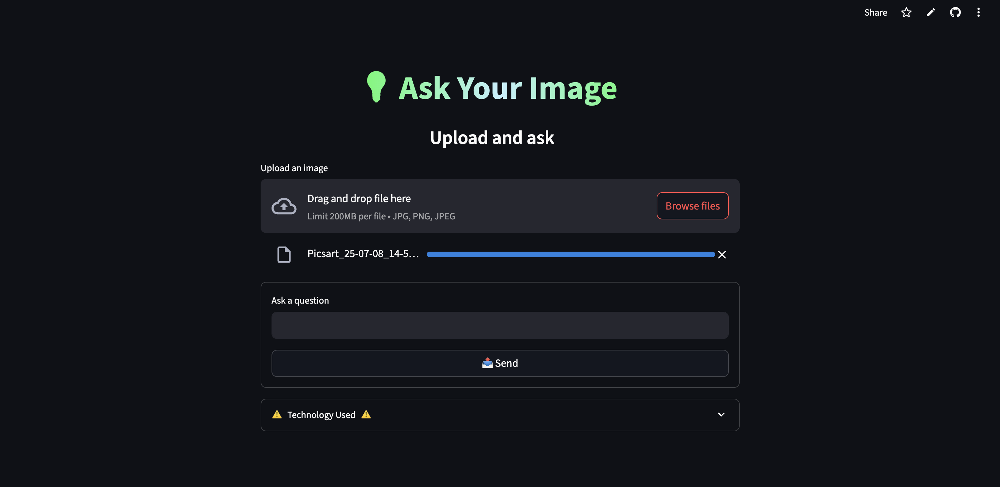

# 🖼️ Ask Your Image — BLIP + Streamlit

A smart **image-based Q\&A assistant** that answers questions about uploaded images and auto-generates captions using the BLIP model — deployed with a clean Streamlit UI.

> ✅ Built with: `BLIP`, `Transformers`, `Streamlit`, `PIL`, `ReportLab`


---

## 📸 Preview



---

## 🧠 Features

* 🖼️ Upload any image
* 📝 Auto-generate **caption** using BLIP
* ❓ Ask **any question** about the image
* 📤 Download the **answer report as PDF**
* 💬 One-click follow-up questions
* 🎨 Clean dark-themed Streamlit UI

---

## 🚀 Getting Started

### 🔧 Prerequisites

* Python 3.8 or higher

---

### 🖥️ Local Installation

```bash
# 1. Clone this repo
git clone https://github.com/rakshath66/Ask-Your-Image.git
cd Ask-Your-Image

# 2. (Optional) Create virtual environment
python -m venv venv
source venv/bin/activate  # or venv\Scripts\activate on Windows

# 3. Install dependencies
pip install -r requirements.txt

# 4. Run the app
streamlit run app.py
```

---

## 🗂️ Project Structure

```
Ask-Your-Image/
├── src/streamlit_app.py                 # Streamlit app with BLIP caption + VQA
├── requirements.txt       # Python dependencies
├── images/
│   └── ui.png             # Preview screenshot
└── README.md              # This file
```

---

## 🔐 Environment Variables

No API keys are needed — models are loaded directly from Hugging Face via Transformers.

If you use Hugging Face token, you can log in using:

```bash
huggingface-cli login
```

---

## 💡 Sample Questions to Try

* "What is happening in the image?"
* "What color is the shirt the person is wearing?"
* "Is this photo taken indoors or outdoors?"
* "What kind of environment is shown here?"
* "Where could this scene be located?"

---

## 🤝 Contributing

We welcome improvements! Here's how to contribute:

### ✅ Steps To Contribute:

1. Fork this repository
2. Clone your fork:
   `git clone https://github.com/rakshath66/Ask-Your-Image.git`
3. Create a new branch:
   `git checkout -b feature/my-feature`
4. Make changes, commit, and push:
   `git commit -m "Add: new feature"`
   `git push origin feature/my-feature`
5. Open a Pull Request with your changes

> 🙌 Clean, tested code is appreciated!

---

## 📃 License

MIT License © [Rakshath U Shetty](https://github.com/rakshath66)

```text
Permission is hereby granted, free of charge, to any person obtaining a copy
of this software... [rest of MIT license]
```

---

## ⭐ Star this project if you found it useful!

It helps more people discover the project and encourages future improvements.

Feel free to open issues or suggest features!

---

## 🛣️ Roadmap

### ✅ Phase 1: MVP (Complete)

* BLIP caption + VQA integration
* PDF report generation
* Streamlit UI with input + answer display

### 🔜 Phase 2: Enhancements

* 🔁 Multi-image upload + selection
* 🗂️ Save Q\&A history
* 📤 Export all answers as zip/pdf
* 🌐 Optionally integrate image caption via OpenAI/Vision models

---

### 🧑‍💻 Built by [Rakshath U Shetty](https://www.linkedin.com/in/rakshathushetty/)

* AI projects for learning & real use
* Always open for contributions and ideas
